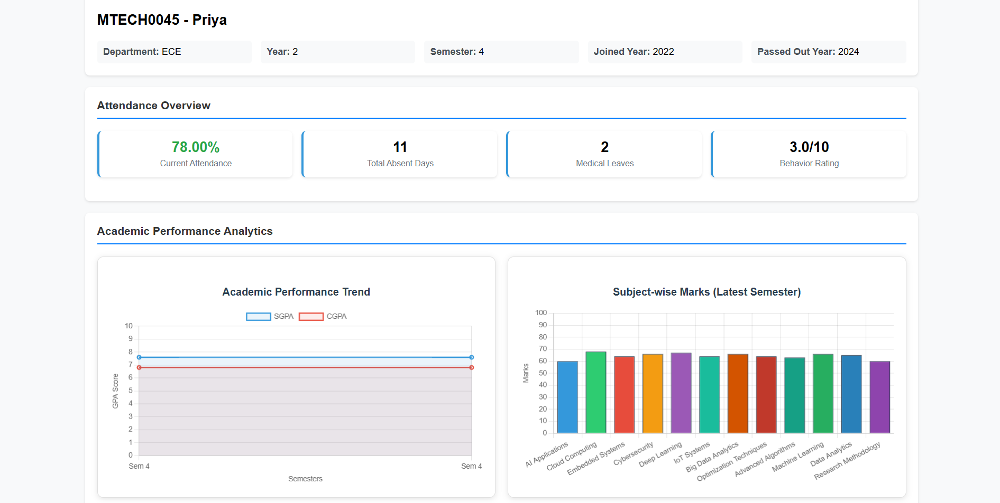
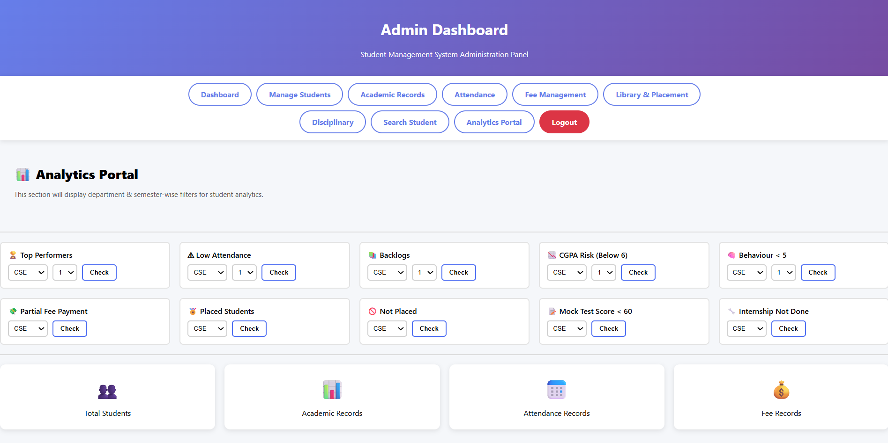
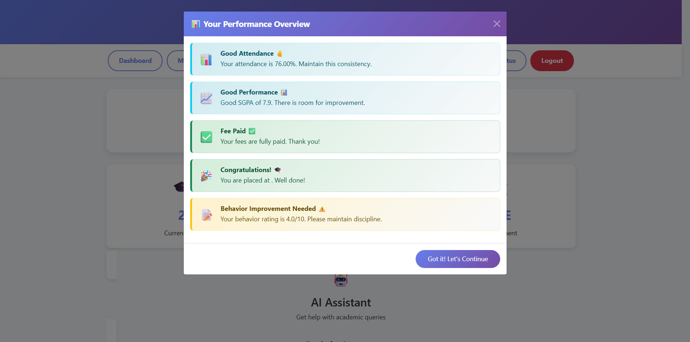
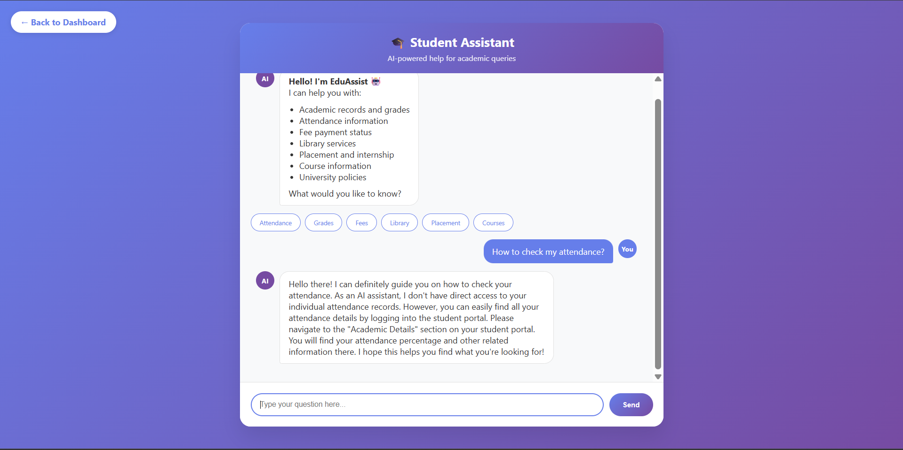

# 🎓 Next-Gen Student Ecosystem

### Turning Student Data into Early Academic Insights

The Next-Gen Student Ecosystem is a rule-based academic analytics platform developed to help educational institutions monitor student performance, identify academic risks at an early stage, and support data-driven decision-making.

The system integrates student academic and administrative data into a centralized dashboard where faculty and administrators can analyze performance, apply advanced filters, identify at-risk students, and access information through a chatbot interface.

---

## 📌 Problem Statement

In many educational institutions, student information is distributed across multiple modules such as academics, attendance, finance, and placements. Existing systems primarily provide basic reports and lack intelligent mechanisms to identify students who may be academically at risk.

Challenges include:

- Fragmented student information
- Lack of centralized monitoring
- Limited filtering and analytics capabilities
- No early warning system for academic risks
- Absence of chatbot-based guidance

To address these challenges, the Next-Gen Student Ecosystem provides a unified and user-friendly analytics platform.

---

## 🚀 Project Objectives

- Integrate student data into a single platform
- Provide a centralized dashboard for monitoring
- Enable advanced filtering and analysis
- Identify academically at-risk students using predefined rules
- Reduce manual monitoring efforts
- Improve accessibility through chatbot support
- Support data-driven academic interventions

---

## ✨ Key Features

### 📊 Unified Student Dashboard

A centralized dashboard that displays academic and administrative student information in one place.

**Benefits:**
- Easy monitoring of student performance
- Quick access to student records
- Visual representation of academic data

---

### 🔍 Advanced Analytics Filters

Faculty and administrators can filter students based on multiple parameters.

**Available Filters:**
- CGPA
- Attendance Percentage
- Backlogs
- Fee Status
- Placement Status

**Benefits:**
- Faster data analysis
- Improved student categorization
- Better academic monitoring

---

### ⚠️ Academic Risk Prediction

The system uses predefined rule-based conditions to identify students who may be at academic risk.

**Risk Factors Considered:**
- Low CGPA
- Poor Attendance
- Academic Backlogs

**Benefits:**
- Early intervention
- Improved student support
- Prevention of academic decline

---

### 🤖 Chatbot Support

A keyword-based chatbot that provides quick assistance and answers frequently asked questions.

**Benefits:**
- Improved accessibility
- Faster information retrieval
- Reduced dependency on manual support

---

## 🛠️ Technologies Used

| Category | Technology |
|-----------|------------|
| Frontend | HTML, CSS, Bootstrap |
| Backend | Django (Python) |
| Database | SQLite |
| Data Processing | Pandas |
| Data Source | Excel |
| Visualization | Chart.js |
| Version Control | Git & GitHub |

---

## 🏗️ System Architecture

```text
Student Data
      │
      ▼
Excel Dataset
      │
      ▼
Pandas Processing
      │
      ▼
Rule-Based Analytics Engine
      │
 ┌────┼────┐
 ▼    ▼    ▼
Dashboard Filters Chatbot
      │
      ▼
Risk Identification & Insights
```

---

## 📷 Results and Screenshots

### 1️⃣ Unified Student Dashboard

The dashboard provides a complete overview of student academic and administrative information in a single interface. It helps faculty monitor student performance efficiently and make informed decisions.



---

### 2️⃣ Advanced Analytics Filters

Advanced filtering functionality enables users to categorize students based on performance indicators such as CGPA, attendance, backlogs, fees, and placement status.



---

### 3️⃣ Academic Risk Prediction

The risk prediction module identifies students who may require academic intervention by evaluating predefined performance thresholds.



---

### 4️⃣ Chatbot Support

The chatbot assists users by answering common questions and providing guidance related to student information and system functionality.



---

## ⚙️ Methodology

### Step 1: Data Collection

Student information is collected from institutional records and Excel datasets.

### Step 2: Data Processing

Pandas is used to clean, organize, and process the collected data.

### Step 3: Rule-Based Analysis

Predefined academic rules are applied to evaluate student performance and identify potential risks.

### Step 4: Visualization

Processed information is displayed through dashboards, charts, and analytics reports.

### Step 5: User Interaction

Faculty and administrators interact with the system using filters and chatbot support.

---

## 📈 Benefits of the System

- Centralized student information management
- Early academic risk identification
- Reduced manual monitoring
- Improved academic decision-making
- Better performance tracking
- User-friendly analytics interface
- Enhanced accessibility through chatbot support

---

## 🔮 Future Scope

The system can be enhanced further by incorporating advanced technologies and intelligent decision-support mechanisms.

Future improvements include:

- Machine Learning-based risk prediction
- Intelligent database-connected chatbot
- Personalized student recommendations
- Real-time institutional database integration
- Mobile application development
- Cloud deployment for scalability
- Organization-specific customization

The platform can also be adapted for corporate environments with minimal modifications.

---

## 👨‍💻 Team Members

| Name | Roll Number |
|--------|-------------|
| Gosetty Chandana | 22101A040012 |
| Gounipalli Lokesh | 22101A040013 |
| Jonna Madhavi | 22101A040016 |
| Polipati Divakar | 22101A040027 |

---

## 🎓 Academic Information

**Project Title:**  
Next-Gen Student Ecosystem: Rule-Based Academic Risk Analytics and Unified Data Integration

**Institution:**  
Mohan Babu University, Tirupati

**Department:**  
Electronics and Communication Engineering (ECE)

**Guided By:**  
Ms. B. Ashreetha, M.Tech (Ph.D)  
Assistant Professor, Department of ECE

---

## 📚 References

1. Afolabi et al. (2025) – Development of an AI-Driven Adaptive Learning Management System Using Data Analytics.

2. Sajja et al. (2025) – Integrating AI and Learning Analytics for Data-Driven Pedagogical Decisions.

3. Strielkowski et al. (2024) – AI-Driven Adaptive Learning for Sustainable Educational Transformation.

4. Hariyanto et al. (2025) – Artificial Intelligence in Adaptive Education.

5. Ilie et al. (2023) – Adaptive Learning Using Artificial Intelligence in E-Learning.

---

## ⭐ Conclusion

The Next-Gen Student Ecosystem successfully transforms student academic data into actionable insights through a unified analytics platform. By combining rule-based risk identification, advanced filtering, visualization, and chatbot support, the system helps educational institutions monitor student performance effectively and take timely academic interventions.

This project demonstrates how data analytics can improve student monitoring, reduce manual effort, and support better academic outcomes.
